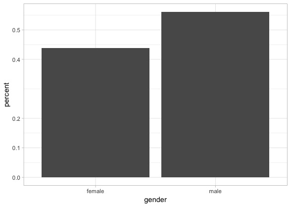

# Judicial Gender Bias
Estimating whether there was gender bias in appointment of Obama judges (09-16).

I wanted to explore if there was the potential for gender bias in the Senatorial review process of Obama's nominees to the Federal Bench.  This project included many challenges and a few tools I'd used before:
1. Web scraping
2. Identifying Gender from first names (R Gender library)

Data was found on [Ballotpedia](https://ballotpedia.org/Federal_judges_nominated_by_Barack_Obama)

Just based on the raw numbers, Barack Obama nominated more male judges than female by a 57 to 43% margin (see below)

Overall, most of these nominees were confirmed by the Senate. However, there is a distinct shift in the confirmation status of nominees in 2015 and 2016.

It appears that in 2015 and 2016 the change in the balance of the senate may have had an impact, or a significant impact, on the approval of justices through the Senate. My inquiry was mostly in regards to whether or not this confirmation status displayed a gender bias.

Another way of visualizing this is to examine the time (in days) that each judicial nominee spent awaiting confirmation, by year. Again in GGPlot, this is very easy to display.

Here you can see there appears to be a disparity between the male and female nominees. This is particularly true in 2014 and 2015, when female nominees appear to spend longer awaiting confirmation.

The final method for testing this is with a logistic regression. While we only have a binary indictor of success (confirmed or not confirmed), a logistic regression allows for us to actually draw a curve between these two binaries and attach statistical significance.

In this regression, you can see through time the relative probability of confirmation based on the gender of each nominee. Through time, there's a very clear decreasing trend which increases in 2015. Notably, the female judicial nominees have a lower probability of success in starting, on average, around 2014.  While the uncertainty envelopes overlap, these results do appear to indicate some amount of bias, just not a statistically significant bias toward male appointments.

See more details and figures on my [blog](https://matthewmorriss.weebly.com/codeblog/obama-judicial-appointments)
